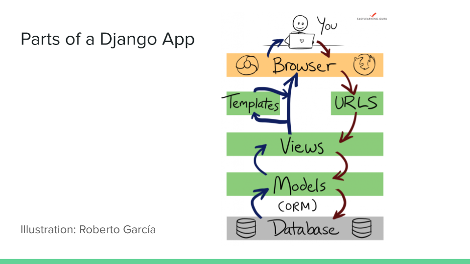

# Intro to Django
### May 11, 2021

--- 

# What even is the Internet?

---

---
## Also...
### A network of interconnected nodes that communicate via packets of data transferred through protocols.

--- 

# How is that different from the WWW?
### The WWW is the content we see 

---

## "A web application is a bunch of data in a fancy shell" 
### - Kim Wheaton

---

## Django History
- Framework for building web applications
- Originated at the Lawrence Journal-World newspaper in Lawrence, Kansas
- Named after jazz musician Django Reinhardt
- Released in 2005
- Used by Mozilla, Instagram, and NextDoor
- “For perfectionists with deadlines”
- MVC architecture
- Model, Template, View

---

---

### Django uses a database called Sqlite by default. Can use other SQL databases as well.
